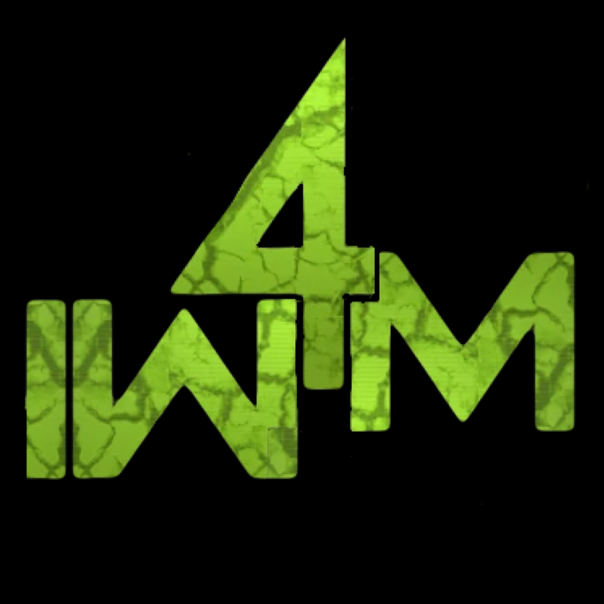

  <video src="https://github.com/MarkusSela/IW4-Pocket/raw/main/media/demo.mp4" controls muted loop playsinline width="100%"></video>

Demo (18 s, iPhone 13 Pro Max) · <a href="https://github.com/MarkusSela/IW4-Pocket/raw/main/media/demo.mp4">Falls das Video nicht startet, direkt öffnen</a>

  

<h1 align="center">IW4 Pocket</h1>

Modern Warfare 2 (2009) auf dem iPhone, mit der Open-Source-Runtime IW4L. Inoffiziell und experimentell.

[English](README.md) · [Italiano](README.it.md) · [Español](README.es.md) · [Français](README.fr.md) · **Deutsch**

## Status

- **Läuft auf dem iPhone** (Rust + Bevy + wgpu auf Metal), als IPA für SideStore verpackt.
- **Erreicht das Hauptmenü.** In den Menüs funktioniert Berührung als Mausklick. Ein PS4-Controller (DualShock 4) funktioniert über Apples GameController-Framework.
- **Bekanntes Problem:** Das Laden einer Match-Karte (getestet: `mp_rust`) stürzt weiterhin ab. iOS beendet die App wegen zu hohem Speicherverbrauch. Das ist in Arbeit und noch nicht gelöst.
- Die Texturbehandlung ist an Apple-GPUs angepasst (keine BC/DXT-Unterstützung: Texturen werden zu RGBA8 dekodiert und in der Größe begrenzt).

## Kompatibilität

Technisch sollte es auf jedem iPhone oder iPad mit Metal und genug freiem Speicher laufen, wurde aber **nur auf einem iPhone 13 Pro Max (6 GB, iOS 27) getestet**. Andere Geräte sind nicht verifiziert. Der Speicher ist der begrenzende Faktor: Auf diesem Telefon gewährt iOS der App etwa 3 GB, Modelle mit weniger RAM scheitern früher.

## Was du brauchst

- Ein iPhone oder iPad mit Metal (iOS 15 oder neuer).
- SideStore (oder ein anderes Sideloading-Tool) zum Installieren der IPA.
- **Deine eigene Kopie der Modern-Warfare-2-(2009)-PC-Spieldaten**, der Ordner mit `zone/`. Hier sind keine Spieldateien enthalten und werden keine bereitgestellt.
- Ein Controller wird dringend empfohlen. PS4 ist verifiziert; Xbox-ähnliche Controller hängen vom Modell ab.

## Installation

1. Lade **IW4 Pocket.ipa** aus dem [neuesten Release](../../releases/latest) herunter.
2. Installiere sie mit SideStore. Installiere über eine ältere Version, damit deine Spieldateien erhalten bleiben; Deinstallieren löscht sie.
3. Öffne die App einmal und kopiere den MW2-PC-Ordner nach **Dateien > Auf meinem iPhone > IW4 Pocket > Games** (jeder Unterordnername geht, solange er `zone/` enthält).
4. Starte die App. Das erste Laden ist langsam und der Bildschirm kann eine Weile rosa bleiben.

## Dateien und Protokolle

Die App schreibt `Documents/iw4l-boot.log` (in der Dateien-App sichtbar). Es enthält Startschritte, die gewählte Texturgrenze, den Speicherverbrauch (`footprint` und was iOS noch erlaubt) sowie jede Panic oder jedes fatale Signal. Füge es bei Problemmeldungen bei.

### Texturgrößenlimit

Das Limit wird automatisch nach dem Speicher gewählt, den iOS der App gewährt. Zum Erzwingen erstelle im selben Ordner eine reine Textdatei `iw4l-texture-cap.txt`, die nur eine Zahl enthält, z. B. `256`, und beende die App vollständig und öffne sie neu.

## Was gegenüber dem ursprünglichen IW4L geändert wurde

- Unter iOS keine BC-Texturen: Sie werden zu RGBA8 dekodiert, mit Größenlimit.
- Das Rendering bleibt im Hauptthread (die Metal-Oberfläche muss dort erstellt werden).
- Pfade in der `Documents`-Sandbox, mit iOS-`Info.plist` und App-Symbol.
- GameController-Brücke für Controller und Touch-Eingabe als linke Maustaste.
- Startprotokoll mit Speicherverfolgung und Erfassung von Absturzsignalen.

## Selbst bauen

Starte den Workflow **ios-release** im Actions-Tab (macOS-Runner). Gib einen Tag an, um ein Release zu veröffentlichen. Bei einem Push läuft nichts automatisch.

## Unterstützen

Wenn dir das Projekt gefällt, kannst du es auf [Ko-fi](https://ko-fi.com/marukoshi) unterstützen.

## Credits und Lizenz

Dieses Projekt ist ein Port von [IW4L](https://github.com/vladtrc/iw4L) von vladtrc und Mitwirkenden, lizenziert unter Apache-2.0 (siehe `LICENSE` und `NOTICE`). Die ursprüngliche README liegt in `README.upstream.md`.

> IW4 Pocket ist ein inoffizielles Fanprojekt. Es steht in keiner Verbindung zu Activision, Infinity Ward, Apple oder den IW4L-Autoren und wird von ihnen nicht unterstützt. Call of Duty und Modern Warfare sind Marken ihrer jeweiligen Inhaber. Du benötigst eine legitime Kopie des Spiels.
